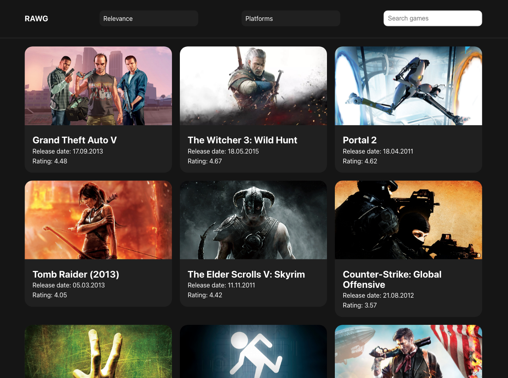
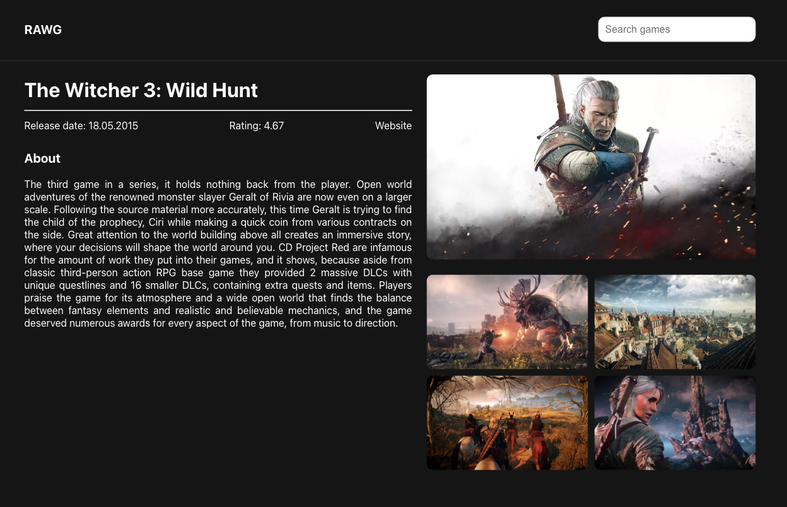

Каталог игр на базе API rawg.io https://rawg.io/apidocs.

SPA на React с использованием Redux, React Router, React Hooks, Styled components.

## Приложение состоит из двух страниц:
1) главная, каталог игр:
    - Пагинация
    - Сортировка по: рейтингу и дате релиза игры (в обе стороны)
    - Фильтрация по платформам
    - Поиск по названию
  - **Содержимое каждой “плитки” игры:**
    - Название
    - Постер
    - Рейтинг
    - Дата релиза
2) /game/[slug] - страница игры, на которую можно попасть, кликнув на плитку игры в каталоге, содержит более полную информацию об игре (помимо имевшейся на плитке):
  - Описание
  - Ссылка на сайт игры
  - Слайдер со скриншотами игры

Screenshot:

